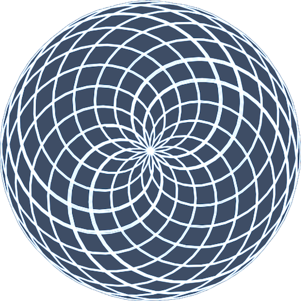

  

<h1 align="center">Irrational Pi - Algorithm Art</h1>

## Project Overview

This project visualizes the irrational nature of Pi by using a double-arm [algorithmic system](https://en.wikipedia.org/wiki/Algorithmic_art). The interactive visualization draws beautiful patterns using the relationship between rotational speeds tied to Pi and customizable drawing parameters. Users can experiment with various controls to generate unique artistic interpretations of Pi's irrationality.

## Inspiration

Credit for the core idea goes to **@fascinating.fractals** and his [video](https://www.youtube.com/shorts/aUDYWYqtAR4) about drawing the irrational Pi. Without his creative content, this visualization would not exist. Please consider supporting his content.

## Preview

  

## Features

- Interactive parameter controls via a customizable panel
- Options to pause, reset, randomize, clear, or save both settings and imagery
- Pixel preservation mode for high-density trail art
- Load and save your favorite settings as JSON
- Download canvas art with one click
- Each session gives you a different way to visually experience Pi

## How to Use

1. Open `index.html` directly in your browser.
2. Use the ⚙️ icon to toggle the controls panel.
3. Adjust sliders or numeric inputs for speed, arm lengths, trail length, arm skip, or line width.
4. Use buttons to pause or play, reset, randomize, clear, or save current visualization or settings.
5. Flip Pixel Mode on or off for alternative rendering.
6. Save your settings as JSON, or load previously saved settings.
7. Download your art when you find a pattern you enjoy.

## How It Was Built

1. For a quick overview. This project was build using [Cursor IDE](https://www.cursor.com/), [Claude App](https://claude.ai/chats), [ChatGPT App](https://chat.openai.com/chat), [Cha](https://github.com/MehmetMHY/cha/), and [Gemini App](https://gemini.google.com/app). And models `Claude 3.7 Sonnet`, `Google Gemini 2.5 Pro`, and `OpenAI o3` were utilized in most of those tools.

2. Used **Cha** to extract the content and description from **@fascinating.fractals** [video](https://www.youtube.com/shorts/aUDYWYqtAR4).

3. The content as a prompt was inputted into [Claude App](https://claude.ai/chats) to generate a prototype and render it though their **Interactive Artifact** side window. Claude's **Claude 3.7 Sonnet** was used for this entire process.

4. After the prototype was good enough and I ran out of free chat memory, I created a local [git](https://git-scm.com/) project and transferred the code from Claude's web app to this local git project.

5. After transferring it, I opened the local project with the **Cursor IDE**, were I have a Pro plan, and I utilized **Claude 3.7 Sonnet** and **Google Gemini 2.5 Pro** to finish implementing the project itself. I did use the **ChatGPT** and **Gemini** web apps to generate ideas and feed it into the **Cursor IDE** to fix more complex bugs. In **ChatGPT** I utilized OpenAI's **o3** model and in **Gemini** I used their **Google Gemini 2.5 Pro** model.

6. I tested the project in my browser by just opening the single index HTML file in my browser.

## License

This project is licensed under the [GNU General Public License v3.0](./LICENSE). Major creative credit goes to [@fascinating.fractals](https://www.youtube.com/shorts/aUDYWYqtAR4) for the algorithmic inspiration.
